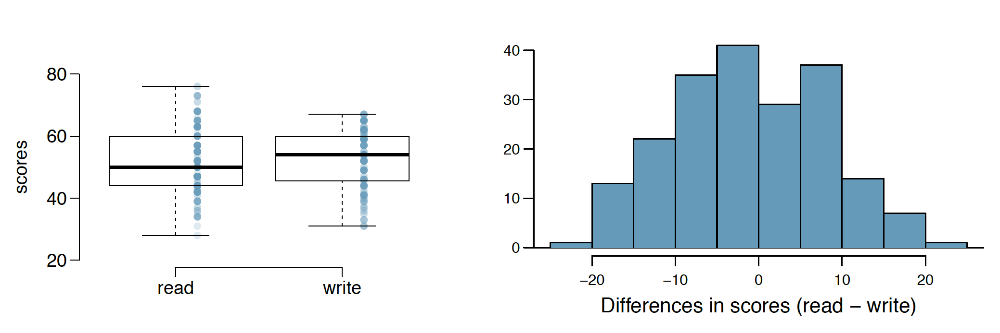
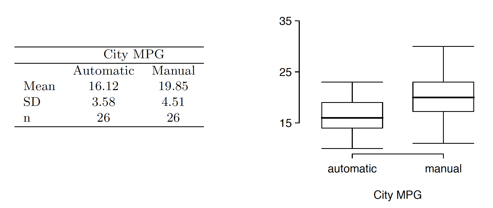
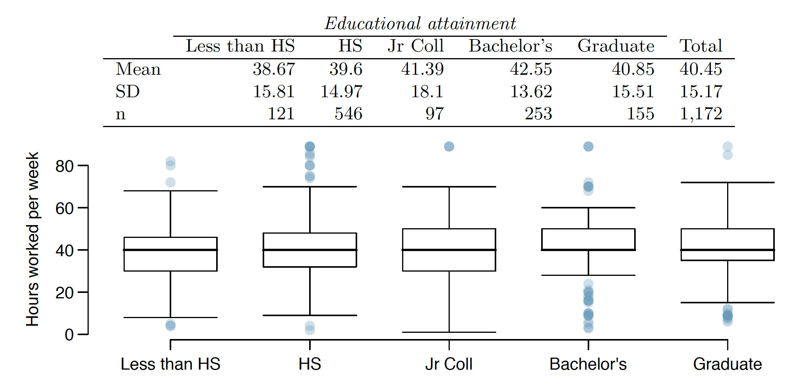
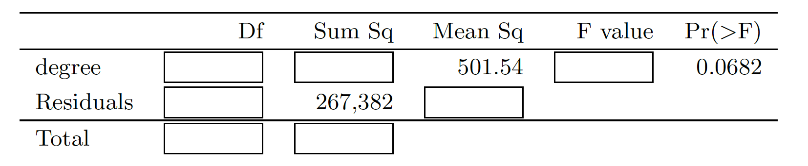

```{r setup, include=FALSE}
knitr::opts_chunk$set(echo = TRUE)
```

#Chapter 5 - Inference for Numerical Data

##5.6 Working backwards, Part II.
A 90% confidence interval for a population mean is (65,77). The population distribution is approximately normal and the population standard deviation is unknown. This confidence interval is based on a simple random sample of 25 observations. Calculate the sample mean, the margin of error, and the sample standard deviation.

```{r}
lower<-65
upper<-77
n<-25
df<-n-1
ME<-(upper-lower)/2
ME #Marging of error
sample_mean<-lower+ME
sample_mean #Sample mean
z<--qt(0.05,df)
z
SE<-(upper-sample_mean)/z
SE
sample_sd<-SE*sqrt(n)
sample_sd #Sample standard deviation
```

#5.14 SAT scores.
SAT scores of students at an Ivy League college are distributed with a standard deviation of 250 points. Two statistics students, Raina and Luke, want to estimate the average SAT score of students at this college as part of a class project. They want their margin of error to be no more than 25 points.

```{r}
sd<-250
ME<-25
```

(a) Raina wants to use a 90% confidence interval. How large a sample should she collect?  

We lookup the z value for a 90% confidence interval, then knowing:

SE = z * (sd / sqrt(n))

We calculate the minimum n or number of samples.

```{r}
z<-qnorm(0.05)
z
n<-(z*(sd/ME))^2
ceiling(n)
```

(b) Luke wants to use a 99% confidence interval. Without calculating the actual sample size, determine whether his sample should be larger or smaller than Raina’s, and explain your reasoning.   

A larger confidence interval represents a larger z value. Since ME is proportional to z, ME would increase if the number of samples are kept the same. Knowing ME is also proportional to SE, we need to decrease ME to counteract a larger z. Since ME is inversely proportional to n, we thus know n has to increase to keep the same ME for the new larger 99% confidence interval.

(c) Calculate the minimum required sample size for Luke.  

We use the same formulas as in (a)

```{r}
z<-qnorm(0.01/2)
z
n<-(z*(sd/ME))^2
ceiling(n)
```

#5.20 High School and Beyond, Part I.
The National Center of Education Statistics conducted a survey of high school seniors, collecting test data on reading, writing, and several other subjects. Here we examine a simple random sample of 200 students from this survey. Side-by-side box plots of reading and writing scores as well as a histogram of the differences in scores are shown below.



(a) Is there a clear difference in the average reading and writing scores?

There is no clear difference shown on the box plots not the distribution. The box plot show similar averages and variance, the distribution of the difference seems to be normal and centered around 0. 

(b) Are the reading and writing scores of each student independent of each other?

There is no indication that they wouldn't be, but one would expect that for each student read and write are not independent skills.

(c) Create hypotheses appropriate for the following research question: is there an evident difference in the average scores of students in the reading and writing exam?

Ho: average scores for reading and writing are the same, so their difference is equal to zero   
    $\mu_{score\_reading}$ = $\mu_{score\_writing}$    
    $\mu_{score\_reading}$ - $\mu_{score\_writing}$ = 0   
    
Ha: average scores for reading and writing are not the same, so their difference is not equal to zero
    $\mu_{score\_reading}$ $\neq$ $\mu_{score\_writing}$    
    $\mu_{score\_reading}$ - $\mu_{score\_writing}$ $\neq$ 0 

(d) Check the conditions required to complete this test.

The distribution seems to be normal, the samples are independent since we are taking 200 observations from surely millions since we are looking at a national population, and lastly we have a good number of samples, over 30, so some skew in the distribution is acceptable. 

(e) The average observed difference in scores is $\bar X_{read−write}$= −0.545, and the standard deviation of the differences is 8.887 points. Do these data provide convincing evidence of a difference between the average scores on the two exams?

As seen in the analysis below, this data does not provide enough evidence.

```{r}
diff_mean<--0.545
diff_sd<-8.887
n<-200
df<-n-1
#we use a 90% confidence level
SE<-diff_sd/sqrt(n)
t<-(diff_mean-0)/SE
t
p<-2*pt(t,df)
p
if (p<0.1) {
  print("Yes, they do provide convincing evidence")
} else {
  print("No they don't provide convincing evidence")
}
```

(f) What type of error might we have made? Explain what the error means in the context of the application.

Type II error, this is because we have failed to reject the null, and if the null is actually not true, we might have failed to conclude that there is in fact a difference between the two scores.

(g) Based on the results of this hypothesis test, would you expect a confidence interval for the average difference between the reading and writing scores to include 0? Explain your reasoning.

Yes, we would expect it to include zero since this would also mean we do not reject the null. That is, with zero within the confidence interval it would mean it is still statistically plausible to obtain a difference between average reading and writing scores as seen in our sample, and yet the population difference is zero.     
The computation of the confidence interval below shows it in fact contains zero.

```{r}
lower<-diff_mean+t
upper<-diff_mean-t
c(lower,upper)
```

##5.32 Fuel efficiency of manual and automatic cars, Part I. 
Each year the US Environmental Protection Agency (EPA) releases fuel economy data on cars manufactured in that year. Below are summary statistics on fuel efficiency (in miles/gallon) from random samples of cars with manual and automatic transmissions manufactured in 2012. Do these data provide strong evidence of a difference between the average fuel efficiency of cars with manual and automatic transmissions in terms of their average city mileage? Assume that conditions for inference are satisfied.




```{r}
mean_auto<-16.12
mean_man<-19.85
sd_auto<-3.58
sd_man<-4.51
n<-26
df<-n-1
diff_mean<-mean_auto-mean_man
#we use a 90% confidence level
SE<-sqrt((sd_auto^2/n)+(sd_man^2/n))
t<-(diff_mean-0)/SE
t
p<-2*pt(t,df)
p
if (p<0.1) {
  print("Yes, they do provide convincing evidence")
} else {
  print("No they don't provide convincing evidence")
}
```

##5.48 Work hours and education. 
The General Social Survey collects data on demographics, education, and work, among many other characteristics of US residents. Using ANOVA, we can consider educational attainment levels for all 1,172 respondents at once. Below are the distributions of hours worked by educational attainment and relevant summary statistics that will be helpful in
carrying out this analysis.



(a) Write hypotheses for evaluating whether the average number of hours worked varies across the five groups.

Ho: The average nummber of hours worked in each group is the same   
    $\mu_{less\_than\_HS}$ = $\mu_{HS}$ = $\mu_{Jr\_Coll}$ = $\mu_{Bachelor's}$ = $\mu_{Graduate}$
    
Ha: At least one of the average working hours in these groups is different

(b) Check conditions and describe any assumptions you must make to proceed with the test.

Conditions that need to be met are:
- The observations need to be independent within the group, and across groups. The number of observations in each group (121, 546, 97, 253 and 155) represents less than 10% of the population, so we consider them independent. Between groups, they are independent because each person can only belong to one educational group, and by assuming the number of people having a certain educational level does not affect the other groups.
- The data distribution within each group needs to be nearly normal. The box plots show data seem to be normal, there isn't an indication of severe skew.
- The variability within each group needs to be very similar. As we can see the standard deviations of each group are fairly similar. We also see similar variance in the box plots for each group.

(c) Below is part of the output associated with this test. Fill in the empty cells.



```{r}
num_groups<-5
n<-1172

Dfg<-num_groups-1
Dfg
Dfe<-n-num_groups
Dfe
totalDf<-Dfg+Dfe
totalDf
MSG<-501.54
SSG<-MSG*Dfg
SSG
SSE<-267382
totalSS<-SSG+SSE
totalSS
MSE<-SSE/Dfe
MSE
F<-MSG/MSE
F
p<-p <- pf(F, Dfg, Dfe,lower.tail=FALSE)
p # we verify our calculations
table<-data.frame(" "=c("degree","Residual","Total"),"Df"=c(Dfg,Dfe,totalDf),"Sum Sq"=c(SSG,SSE,totalSS),"Mean Sq"=c(MSG,round(MSE,2),""),"F value"=c(round(F,4),"",""),"Pr(>F)"=c(round(p,4),"",""))
table
```

(d) What is the conclusion of the test?

Looking at our resulting p value, and using a cutoff of 0.05, we fail to reject the null. That is we do not find enough evidence to conclude that the average number of hours worked in each group is different. 
